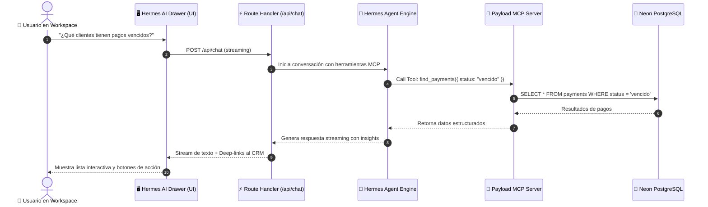

# 🏛️ MANUAL ARQUITECTÓNICO & BLUEPRINT: MARTES WORKSPACE SUITE

Este documento sirve como la **Guía Maestra de Arquitectura** para el desarrollo de la interfaz de usuario (UI) del **Martes Workspace Suite**, una aplicación empresarial moderna sobre **Next.js 16 + Payload CMS 3.88 + Neon Postgres**, manteniendo el panel de administración nativo de Payload (`/admin`) como el Superadmin del sistema.

---

## 🎯 1. Filosofía Arquitectónica y Separación de Capas

```
┌────────────────────────────────────────────────────────────────────────────────────────┐
│                                   MARTES PLATFORM                                      │
├─────────────────────────────────────────┬──────────────────────────────────────────────┤
│ 👑 CAPA SUPERADMIN (/admin)             │ 💼 CAPA WORKSPACE SUITE (/ o /(workspace))   │
│ - Admin nativo de Payload CMS 3.x       │ - Aplicación fullstack personalizada         │
│ - Gestión de esquemas crudos y DB       │ - Centro de comando operativo diario         │
│ - Configuración de tenants y roles      │ - CRM, Tareas, Social, Facturación, Inbox    │
│ - Backoffice de bajo nivel              │ - Sidecar de IA Hermes (Consulta en vivo)    │
├─────────────────────────────────────────┴──────────────────────────────────────────────┤
│ 🔌 MOTOR CENTRAL: Payload Local API + Auth Session + MCP Server + Neon PostgreSQL     │
└────────────────────────────────────────────────────────────────────────────────────────┘
```

### Principios Fundamentales:
1. **Zero Destructive Edits en `/admin`**: El admin de Payload permanece inalterado como la consola técnica de administración (Superadmin).
2. **Autenticación Unificada**: La aplicación del Workspace comparte las cookies HTTP-only de sesión (`payload-token`) verificadas en los Server Components mediante `payload.auth({ headers })`.
3. **Hermes AI Sidecar (Solo Consulta)**: El agente de IA se comunica mediante el protocolo MCP oficial (`@payloadcms/plugin-mcp`), permitiendo consultas en lenguaje natural con total seguridad sin riesgo de mutaciones destructivas.

---

## 🤖 2. Cómo Funciona la Conexión de Hermes AI vía MCP

El protocolo **Model Context Protocol (MCP)** es el estándar oficial de Payload para conectar agentes inteligentes:



### ¿Es Oficial de Payload?
**Sí**. Payload 3.x incluye el paquete oficial `@payloadcms/plugin-mcp`. Al registrarlo en `src/payload.config.ts`, Payload expone endpoints y herramientas estándar que cualquier cliente MCP (como Hermes o agentes externos) puede consumir de forma tipada y segura.

---

## 🧭 3. Estructura de Rutas y Módulos de la Aplicación

```
src/app/(workspace)/
├── layout.tsx                # Shell maestro con Auth Guard, Sidebar, Header y Drawer IA
├── page.tsx                  # Redirige a /overview
│
├── overview/page.tsx         # 📊 Command Center Ejecutivo (Pulso del día, métricas, 'Hoy')
├── crm/page.tsx              # 💼 CRM Studio (Pipeline Kanban, Clientes 360°, Scoring)
├── tasks/page.tsx            # ⚡ Task Manager (Kanban de tareas, Subtareas, Prioridades)
├── inbox/page.tsx            # 💬 Omnichannel Inbox (WhatsApp, Instagram DM, Email)
├── social/page.tsx           # 📱 Social Content Hub (Calendario editorial, programación)
├── billing/page.tsx          # 💰 Commerce & Facturación (Catálogo, Cotizaciones, Facturas PDF)
├── analytics/page.tsx        # 📈 Inteligencia & Reportes (Conversión, NPS de Tally)
│
└── components/
    ├── WorkspaceSidebar.tsx  # Navegación izquierda con estado activo y badges
    ├── WorkspaceHeader.tsx   # Barra de comando superior (Búsqueda ⌘K, Live Status)
    └── HermesAiSidecar.tsx   # Drawer lateral derecho de IA (Consulta y Streaming)
```

---

## 🎨 4. Design System Tokens (Paleta Hermes Dark)

```css
/* Tokens Oficiales de Diseño */
--bg-workspace: #050505;        /* Deep Black */
--surface-card: #090909;        /* Superficie de tarjeta */
--surface-subtle: #111111;      /* Superficie secundaria / hover */
--border-default: #1a1a1a;      /* Borde sutil */
--border-hover: #333333;        /* Borde en foco/hover */
--text-primary: #ffffff;        /* Texto principal */
--text-secondary: #888888;      /* Texto de apoyo */
--text-muted: #555555;          /* Micro-etiquetas / placeholders */

/* Acentos de Espectro */
--spectrum-rainbow: linear-gradient(to right, #ff3333, #ffaa00, #00ffaa, #00aaff, #aa00ff);
--status-success: #00ffaa;      /* Verde neón: Pagado / Conectado / Positivo */
--status-warning: #ffaa00;      /* Ámbar: Pendiente / Por vencer */
--status-danger: #ff3333;       /* Rojo: Vencido / Error / Queja Tally */
```

---

## 🔌 5. Contratos de Datos por Módulo

| Módulo | Endpoint / Query Local | Datos Principales | Acciones de UI |
|---|---|---|---|
| **Overview** | `/api/followups/hoy`<br/>`/api/payments`<br/>`/api/notifications` | Seguimientos clasificados, cobros del mes, alertas activas | Click-to-chat WhatsApp (`wa.me`), resolución de alertas |
| **CRM** | `payload.find({ collection: 'leads' })`<br/>`payload.find({ collection: 'clients' })` | Pipeline Kanban (`nuevo` ➔ `calificado`), ficha 360° | Arrastrar etapas, vincular notas, abrir chat |
| **Tasks** | `payload.find({ collection: 'tasks' })` | Tareas (`pendiente` ➔ `completada`), subtareas, prioridad | Checkbox de checklist, cambiar asignado/fecha |
| **Inbox** | `payload.find({ collection: 'conversations' })`<br/>`payload.find({ collection: 'messages' })` | Hilos de chat, canal, estado Meta, último mensaje | Responder mensaje, insertar plantilla aprobada |
| **Social** | `payload.find({ collection: 'social-posts' })`<br/>`payload.find({ collection: 'post-metrics' })` | Calendario mensual, estados de post, métricas | Programar publicación, previsualizar en móvil |
| **Billing** | `payload.find({ collection: 'quotes' })`<br/>`payload.find({ collection: 'invoices' })` | Line items, PDF versionado en Media, estado de pago | Descargar PDF, enviar por email vía Resend |
| **Analytics** | `/api/form-submissions`<br/>`/api/email-log` | NPS Tally, tasas de rebote de email, conversión | Filtrar por fechas, exportar a CSV/JSON |
